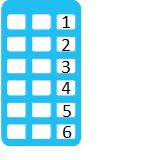
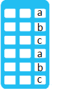
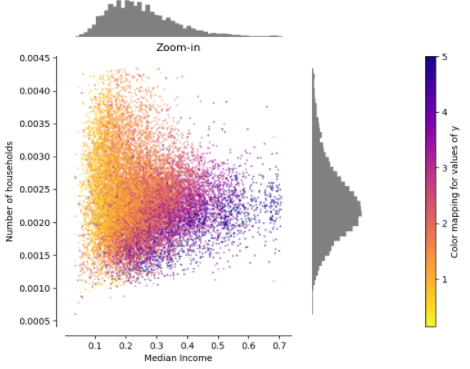
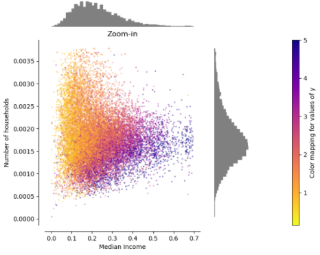
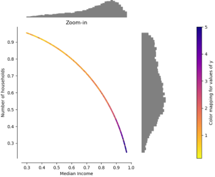
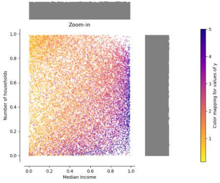
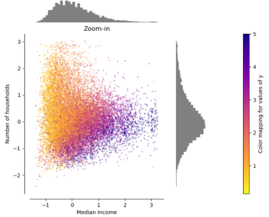
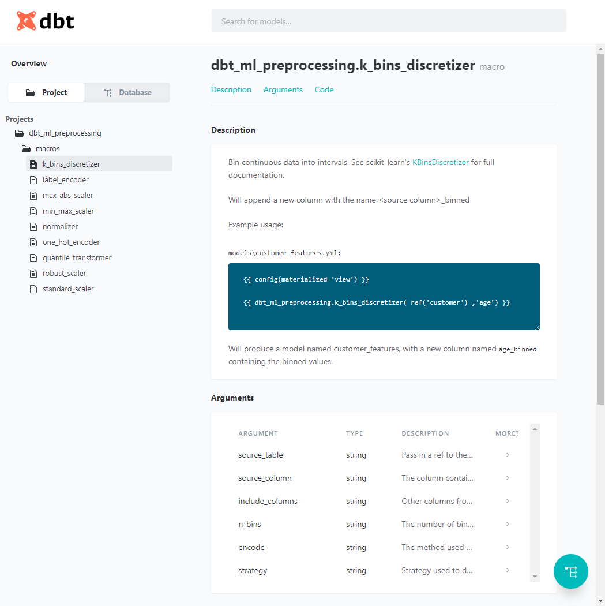

# dbt-ml-preprocessing

A package for dbt which enables standardization of data sets. You can use it to build a feature store in your data warehouse, without using external libraries like Spark's mllib or Python's scikit-learn.

The package contains a set of macros that mirror the functionality of the [scikit-learn preprocessing module](https://scikit-learn.org/stable/modules/preprocessing.html). Originally they were developed as part of the 2019 Medium article [Feature Engineering in Snowflake](https://medium.com/omnata/feature-engineering-in-snowflake-4312032e0d53).

Currently they have been tested in Snowflake, Redshift , BigQuery, SQL Server and PostgreSQL 13.2. The test case expectations have been built using scikit-learn (see *.py in [integration_tests/data/sql](integration_tests/data/sql)), so you can expect behavioural parity with it.

The macros are:

| scikit-learn function | macro name | Snowflake | BigQuery | Redshift | MSSQL | PostgreSQL | Example |
| --- | --- | --- | --- | --- | --- | --- | --- |
| [KBinsDiscretizer](https://scikit-learn.org/stable/modules/generated/sklearn.preprocessing.KBinsDiscretizer.html#sklearn.preprocessing.KBinsDiscretizer)| k_bins_discretizer  | Y | Y | Y | Y | Y |  |
| [LabelEncoder](https://scikit-learn.org/stable/modules/generated/sklearn.preprocessing.LabelEncoder.html#sklearn.preprocessing.LabelEncoder)| label_encoder  | Y | Y | Y | Y | Y |  |
| [MaxAbsScaler](https://scikit-learn.org/stable/modules/generated/sklearn.preprocessing.MaxAbsScaler.html#sklearn.preprocessing.MaxAbsScaler) | max_abs_scaler | Y | Y | Y | Y | Y | [](https://scikit-learn.org/stable/auto_examples/preprocessing/plot_all_scaling.html#maxabsscaler) |
| [MinMaxScaler](https://scikit-learn.org/stable/modules/generated/sklearn.preprocessing.MinMaxScaler.html#sklearn.preprocessing.MinMaxScaler) | min_max_scaler | Y | Y | Y | Y | Y | [](https://scikit-learn.org/stable/auto_examples/preprocessing/plot_all_scaling.html#minmaxscaler) |
| [Normalizer](https://scikit-learn.org/stable/modules/generated/sklearn.preprocessing.Normalizer.html#sklearn.preprocessing.Normalizer) | normalizer | Y | Y | Y | Y | Y | [](https://scikit-learn.org/stable/auto_examples/preprocessing/plot_all_scaling.html#normalizer) |
| [OneHotEncoder](https://scikit-learn.org/stable/modules/generated/sklearn.preprocessing.OneHotEncoder.html#sklearn.preprocessing.OneHotEncoder) | one_hot_encoder | Y | Y | Y | Y | Y |  |
| [QuantileTransformer](https://scikit-learn.org/stable/modules/generated/sklearn.preprocessing.QuantileTransformer.html#sklearn.preprocessing.QuantileTransformer) | quantile_transformer | Y | Y | N | N | Y | [](https://scikit-learn.org/stable/auto_examples/preprocessing/plot_all_scaling.html#quantiletransformer-uniform-output) |
| [RobustScaler](https://scikit-learn.org/stable/modules/generated/sklearn.preprocessing.RobustScaler.html#sklearn.preprocessing.RobustScaler) | robust_scaler | Y | Y | Y | Y | Y | [](https://scikit-learn.org/stable/auto_examples/preprocessing/plot_all_scaling.html#robustscaler) |
| [StandardScaler](https://scikit-learn.org/stable/modules/generated/sklearn.preprocessing.StandardScaler.html#sklearn.preprocessing.StandardScaler) | standard_scaler | Y | Y | Y | N | Y | [](https://scikit-learn.org/stable/auto_examples/preprocessing/plot_all_scaling.html#standardscaler) |

_\* 2D charts taken from [scikit-learn.org](https://scikit-learn.org/stable/auto_examples/preprocessing/plot_all_scaling.html), GIFs are my own_
## Installation
To use this in your dbt project, create or modify packages.yml to include:
```
packages:
  - package: "omnata-labs/dbt_ml_preprocessing"
    version: [">=1.0.2"]
```
_(replace the revision number with the latest)_

Then run:
```dbt deps``` to import the package.

### dbt 1.0.0 compatibility
dbt-ml-preprocessing version 1.2.0 is the first version to support (and require) dbt 1.0.0.

If you are not ready to upgrade to dbt 1.0.0, please use dbt-ml-preprocessing version 1.0.2.

## Usage
To read the macro documentation and see examples, simply [generate your docs](https://docs.getdbt.com/reference/commands/cmd-docs/), and you'll see macro documentation in the Projects tree under ```dbt_ml_preprocessing```:




